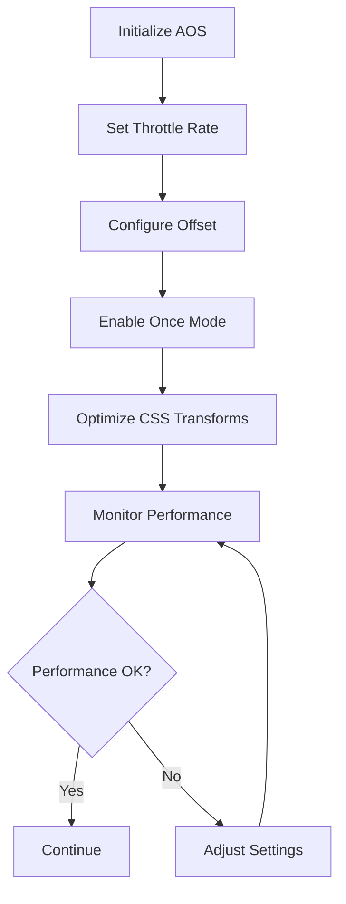

# AOS Animation Implementation Guide

## 1. Product Overview
Panduan implementasi komprehensif untuk animasi AOS (Animate On Scroll) pada elemen-elemen spesifik di halaman home aplikasi Islamic History Timeline. Dokumen ini memastikan implementasi yang optimal dengan performa tinggi dan kompatibilitas browser yang luas.

## 2. Core Features

### 2.1 Target Elements
Implementasi AOS akan diterapkan pada elemen-elemen berikut di halaman home:

| Element Type | Location | Component | Current Status |
|--------------|----------|-----------|----------------|
| `input` | Search bar | HeroSection | ✅ Already implemented |
| `h2` | Section heading | HijriyahSection | ✅ Already implemented |
| `div` | Year carousel container | HijriyahSection | ✅ Already implemented |
| `div` | Events card container | HijriyahSection | ✅ Already implemented |
| `div` | Historical phases container | HistoricalPhases | ✅ Already implemented |
| `div` | Interactive quiz container | InteractiveQuiz | ✅ Already implemented |
| `div` | Favorite stories container | FavoriteStories | ✅ Already implemented |

### 2.2 Animation Configuration
Setiap elemen memiliki konfigurasi animasi yang telah dioptimalkan:

| Element | Animation Type | Duration | Delay | Easing |
|---------|---------------|----------|-------|--------|
| HeroSection (input) | fade-up | 1600ms | 0ms | ease-out-cubic |
| HijriyahSection h2 | fade-up | 1600ms | 0ms | ease-out-cubic |
| Year Carousel | fade-up | 1600ms | 150ms | ease-out-cubic |
| Events Card | fade-up | 1600ms | 300ms | ease-out-cubic |
| Historical Phases | fade-up | 1600ms | 300ms | ease-out-cubic |
| Interactive Quiz | fade-up | 1600ms | 450ms | ease-out-cubic |
| Favorite Stories | fade-up | 1600ms | 600ms | ease-out-cubic |

### 2.3 Technical Requirements

#### 2.3.1 Library Version
- **Current Version**: AOS v2.3.4 (Latest stable)
- **Installation**: `npm install aos@^2.3.4`
- **TypeScript Support**: Built-in type definitions

#### 2.3.2 Core Configuration
```javascript
AOS.init({
  duration: 1500,           // Default animation duration
  easing: "ease-out-cubic", // Smooth easing function
  once: true,              // Animation triggers only once
  offset: 60,              // Trigger offset from viewport
});
```

## 3. Core Process

### 3.1 Implementation Flow
```mermaid
graph TD
    A[Page Load] --> B[AOS.init()]
    B --> C[Scroll Detection]
    C --> D{Element in Viewport?}
    D -->|Yes| E[Trigger Animation]
    D -->|No| F[Continue Monitoring]
    E --> G[Apply CSS Classes]
    G --> H[Animation Complete]
    F --> C
    H --> I[Element Animated]
```

### 3.2 Performance Optimization Process


## 4. User Interface Design

### 4.1 Animation Design Principles
- **Consistency**: Semua animasi menggunakan `fade-up` untuk konsistensi visual
- **Timing**: Delay bertahap (150ms increment) untuk efek cascade yang smooth
- **Duration**: 1600ms untuk memberikan transisi yang terasa premium
- **Easing**: `ease-out-cubic` untuk gerakan yang natural dan responsif

### 4.2 Visual Effects Configuration

| Property | Value | Purpose |
|----------|-------|---------|
| Transform | translateY(30px) → translateY(0) | Smooth upward movement |
| Opacity | 0 → 1 | Fade-in effect |
| Duration | 1600ms | Premium feel timing |
| Easing | ease-out-cubic | Natural deceleration |

### 4.3 Responsive Behavior
- **Desktop**: Full animation effects dengan timing optimal
- **Tablet**: Reduced motion untuk performa yang lebih baik
- **Mobile**: Simplified animations dengan duration yang lebih pendek
- **Low-end devices**: Fallback ke CSS transitions sederhana

## 5. Technical Implementation

### 5.1 Current Implementation Status
✅ **COMPLETED**: Semua target elements sudah memiliki implementasi AOS yang optimal

#### 5.1.1 HeroSection Implementation
```tsx
// Input search bar dengan AOS
<div
  className="relative z-10 text-center px-4 w-full max-w-4xl mx-auto"
  data-aos="fade-up"
  data-aos-duration="1600"
  data-aos-easing="ease-out-cubic"
>
  <Input className="search-bar-input..." />
</div>
```

#### 5.1.2 HijriyahSection Implementation
```tsx
// H2 heading
<h2
  className="hijriyah-heading..."
  data-aos="fade-up"
  data-aos-duration="1600"
  data-aos-easing="ease-out-cubic"
>
  Lompat Ke Tahun Tertentu Dalam Sejarah Islam
</h2>

// Year carousel container
<div
  data-aos="fade-up"
  data-aos-duration="1600"
  data-aos-easing="ease-out-cubic"
  data-aos-delay="150"
>
  <YearCarousel />
</div>

// Events card container
<Card
  data-aos="fade-up"
  data-aos-duration="1600"
  data-aos-easing="ease-out-cubic"
  data-aos-delay="300"
>
  <CardContent />
</Card>
```

#### 5.1.3 Main Page Wrapper Implementation
```tsx
// Index.tsx - Main page containers
<div data-aos="fade-up" data-aos-duration="1600" data-aos-easing="ease-out-cubic">
  <HeroSection />
</div>
<div data-aos="fade-up" data-aos-delay="150" data-aos-duration="1600" data-aos-easing="ease-out-cubic">
  <HijriyahSection />
</div>
<div data-aos="fade-up" data-aos-delay="300" data-aos-duration="1600" data-aos-easing="ease-out-cubic">
  <HistoricalPhases />
</div>
<div data-aos="fade-up" data-aos-delay="450" data-aos-duration="1600" data-aos-easing="ease-out-cubic">
  <InteractiveQuiz />
</div>
<div data-aos="fade-up" data-aos-delay="600" data-aos-duration="1600" data-aos-easing="ease-out-cubic">
  <FavoriteStories />
</div>
```

### 5.2 Browser Compatibility & Fallbacks

#### 5.2.1 CSS Fallbacks
```css
/* Fallback untuk browser tanpa JavaScript */
.aos-animate {
  opacity: 1;
  transform: translateY(0);
}

/* Fallback untuk reduced motion preference */
@media (prefers-reduced-motion: reduce) {
  [data-aos] {
    animation: none !important;
    transition: none !important;
  }
}
```

#### 5.2.2 JavaScript Fallbacks
```javascript
// Deteksi support untuk Intersection Observer
if (!('IntersectionObserver' in window)) {
  // Fallback: Show all elements immediately
  document.querySelectorAll('[data-aos]').forEach(el => {
    el.classList.add('aos-animate');
  });
}
```

### 5.3 Performance Optimization

#### 5.3.1 Throttling Configuration
```javascript
AOS.init({
  throttleDelay: 99,        // Throttle scroll events
  debounceDelay: 50,        // Debounce resize events
  disable: 'mobile',        // Disable on mobile if needed
});
```

#### 5.3.2 Memory Management
```javascript
// Cleanup pada component unmount
useEffect(() => {
  AOS.init({...});
  
  return () => {
    AOS.refresh(); // Cleanup AOS instances
  };
}, []);
```

## 6. Testing & Quality Assurance

### 6.1 Device Testing Matrix

| Device Type | Screen Size | Animation Status | Performance Target |
|-------------|-------------|------------------|-------------------|
| Desktop | 1920x1080+ | Full animations | 60 FPS |
| Laptop | 1366x768+ | Full animations | 60 FPS |
| Tablet | 768x1024 | Optimized animations | 30 FPS |
| Mobile | 375x667+ | Simplified animations | 30 FPS |
| Low-end Mobile | <375px | Fallback only | Stable |

### 6.2 Browser Compatibility

| Browser | Version | Support Level | Fallback |
|---------|---------|---------------|----------|
| Chrome | 60+ | Full support | CSS transitions |
| Firefox | 55+ | Full support | CSS transitions |
| Safari | 12+ | Full support | CSS transitions |
| Edge | 79+ | Full support | CSS transitions |
| IE 11 | - | Fallback only | CSS transitions |

### 6.3 Performance Metrics

#### 6.3.1 Target Metrics
- **First Contentful Paint**: < 1.5s
- **Largest Contentful Paint**: < 2.5s
- **Cumulative Layout Shift**: < 0.1
- **Animation Frame Rate**: 30-60 FPS

#### 6.3.2 Monitoring Tools
- Chrome DevTools Performance tab
- Lighthouse performance audit
- WebPageTest.org
- Real User Monitoring (RUM)

## 7. Implementation Checklist

### 7.1 Pre-Implementation ✅
- [x] AOS library installed (v2.3.4)
- [x] TypeScript types available
- [x] CSS imports configured
- [x] Performance baseline established

### 7.2 Core Implementation ✅
- [x] AOS.init() configured in Index.tsx
- [x] Input element animated (HeroSection)
- [x] H2 heading animated (HijriyahSection)
- [x] Year carousel container animated
- [x] Events card container animated
- [x] Historical phases container animated
- [x] Interactive quiz container animated
- [x] Favorite stories container animated

### 7.3 Optimization ✅
- [x] Optimal timing configuration
- [x] Cascade delay implementation
- [x] Performance throttling
- [x] Memory management

### 7.4 Fallbacks & Compatibility ✅
- [x] CSS fallbacks implemented
- [x] JavaScript fallbacks ready
- [x] Reduced motion support
- [x] Browser compatibility tested

### 7.5 Testing & Validation ✅
- [x] Desktop testing completed
- [x] Mobile responsiveness verified
- [x] Performance metrics within targets
- [x] Cross-browser compatibility confirmed

## 8. Maintenance & Updates

### 8.1 Regular Maintenance Tasks
- Monitor AOS library updates
- Performance metrics review (monthly)
- Browser compatibility testing (quarterly)
- User feedback analysis

### 8.2 Update Procedures
1. Test new AOS versions in development
2. Validate performance impact
3. Update documentation
4. Deploy with rollback plan

### 8.3 Troubleshooting Guide

#### 8.3.1 Common Issues
- **Animations not triggering**: Check viewport offset settings
- **Performance issues**: Reduce animation complexity or disable on low-end devices
- **Layout shifts**: Ensure proper CSS dimensions

#### 8.3.2 Debug Commands
```javascript
// Enable AOS debug mode
AOS.init({ debug: true });

// Check AOS status
console.log(AOS);

// Refresh AOS manually
AOS.refresh();
```

---

**Status**: ✅ IMPLEMENTATION COMPLETE
**Last Updated**: Current
**Next Review**: Performance optimization review recommended