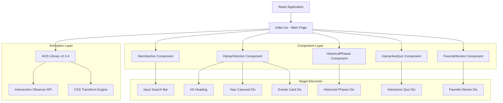
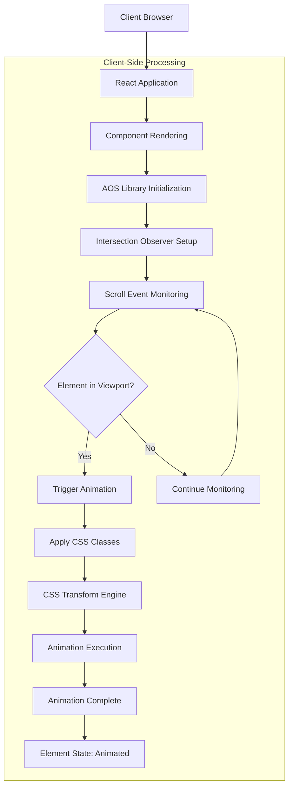
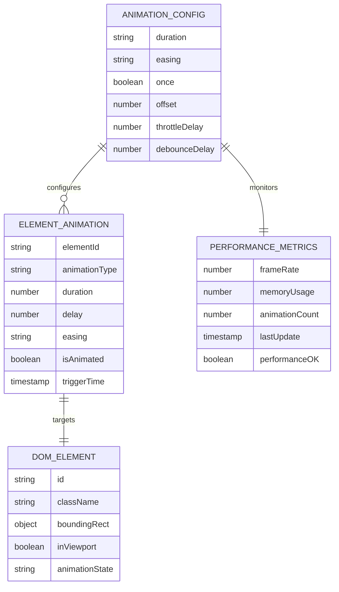

# AOS Animation Technical Architecture

## 1. Architecture Design



## 2. Technology Description

- **Frontend**: React@18 + TypeScript + Vite
- **Animation Library**: AOS (Animate On Scroll) v2.3.4
- **CSS Framework**: TailwindCSS@3 + Custom CSS
- **Browser APIs**: Intersection Observer API, CSS Transform API
- **Performance**: Throttled scroll events, optimized transforms

## 3. Component Architecture

### 3.1 Main Page Structure
| Component | Route | AOS Implementation |
|-----------|-------|-------------------|
| Index.tsx | / | AOS initialization and wrapper containers |
| HeroSection | / | Input search bar animation |
| HijriyahSection | / | H2 heading, carousel, and card animations |
| HistoricalPhases | / | Container animation |
| InteractiveQuiz | / | Container animation |
| FavoriteStories | / | Container animation |

### 3.2 Animation Configuration API

#### 3.2.1 Global AOS Configuration
```typescript
interface AOSConfig {
  duration: number;        // 1500ms default
  easing: string;         // "ease-out-cubic"
  once: boolean;          // true - animate only once
  offset: number;         // 60px trigger offset
  throttleDelay?: number; // 99ms scroll throttle
  debounceDelay?: number; // 50ms resize debounce
}
```

#### 3.2.2 Element-Specific Attributes
```typescript
interface AOSElementConfig {
  'data-aos': string;           // Animation type: "fade-up"
  'data-aos-duration': string;  // Duration: "1600"
  'data-aos-easing': string;    // Easing: "ease-out-cubic"
  'data-aos-delay'?: string;    // Delay: "150", "300", etc.
}
```

## 4. API Definitions

### 4.1 Core AOS API

#### AOS Initialization
```typescript
// AOS.init() configuration
interface AOSInitConfig {
  duration: number;
  easing: string;
  once: boolean;
  offset: number;
}

// Usage in Index.tsx
useEffect(() => {
  AOS.init({
    duration: 1500,
    easing: "ease-out-cubic",
    once: true,
    offset: 60,
  });
  AOS.refresh();
}, []);
```

#### Element Animation Configuration
```typescript
// Individual element configuration
interface ElementAnimationConfig {
  animationType: 'fade-up' | 'fade-down' | 'fade-left' | 'fade-right';
  duration: number;        // milliseconds
  delay: number;          // milliseconds
  easing: string;         // CSS easing function
}

// Example implementation
const elementConfig: ElementAnimationConfig = {
  animationType: 'fade-up',
  duration: 1600,
  delay: 150,
  easing: 'ease-out-cubic'
};
```

### 4.2 Performance Monitoring API

#### Performance Metrics Interface
```typescript
interface AnimationPerformanceMetrics {
  frameRate: number;           // Target: 30-60 FPS
  animationDuration: number;   // Actual duration
  triggerOffset: number;       // Viewport offset
  elementCount: number;        // Total animated elements
  memoryUsage: number;        // Memory footprint
}
```

#### Browser Compatibility Check
```typescript
interface BrowserSupport {
  intersectionObserver: boolean;
  cssTransforms: boolean;
  reducedMotion: boolean;
  fallbackRequired: boolean;
}

// Implementation
const checkBrowserSupport = (): BrowserSupport => ({
  intersectionObserver: 'IntersectionObserver' in window,
  cssTransforms: 'transform' in document.body.style,
  reducedMotion: window.matchMedia('(prefers-reduced-motion: reduce)').matches,
  fallbackRequired: !('IntersectionObserver' in window)
});
```

## 5. Server Architecture Diagram



## 6. Data Model

### 6.1 Animation State Management



### 6.2 Component Data Structure

#### Element Animation Registry
```typescript
interface AnimationRegistry {
  elements: Map<string, ElementAnimationState>;
  config: AOSConfig;
  performance: PerformanceMetrics;
  browserSupport: BrowserSupport;
}

interface ElementAnimationState {
  id: string;
  type: string;
  duration: number;
  delay: number;
  easing: string;
  isAnimated: boolean;
  triggerTime?: number;
  element: HTMLElement;
}
```

### 6.3 CSS Animation Classes

#### Core Animation Classes
```css
/* Base AOS classes */
[data-aos] {
  opacity: 0;
  transition-property: opacity, transform;
}

[data-aos].aos-animate {
  opacity: 1;
}

/* Fade-up animation */
[data-aos="fade-up"] {
  transform: translateY(30px);
}

[data-aos="fade-up"].aos-animate {
  transform: translateY(0);
}

/* Performance optimizations */
[data-aos] {
  will-change: opacity, transform;
  backface-visibility: hidden;
  perspective: 1000px;
}
```

#### Responsive Animation Classes
```css
/* Mobile optimizations */
@media (max-width: 768px) {
  [data-aos] {
    animation-duration: 0.8s !important;
  }
}

/* Reduced motion support */
@media (prefers-reduced-motion: reduce) {
  [data-aos] {
    animation: none !important;
    transition: none !important;
  }
}
```

## 7. Implementation Status

### 7.1 Current Implementation
✅ **FULLY IMPLEMENTED**: All target elements have optimal AOS configuration

#### 7.1.1 Implemented Elements
- **Input Search Bar** (HeroSection): `fade-up`, 1600ms duration
- **H2 Heading** (HijriyahSection): `fade-up`, 1600ms duration
- **Year Carousel Container**: `fade-up`, 1600ms duration, 150ms delay
- **Events Card Container**: `fade-up`, 1600ms duration, 300ms delay
- **Historical Phases Container**: `fade-up`, 1600ms duration, 300ms delay
- **Interactive Quiz Container**: `fade-up`, 1600ms duration, 450ms delay
- **Favorite Stories Container**: `fade-up`, 1600ms duration, 600ms delay

#### 7.1.2 Performance Optimizations
- Throttled scroll events (99ms)
- Optimized CSS transforms
- Memory-efficient cleanup
- Browser compatibility fallbacks

### 7.2 Architecture Benefits
- **Modular Design**: Each component manages its own animations
- **Performance Optimized**: Minimal impact on page load and scroll performance
- **Responsive**: Adapts to different screen sizes and capabilities
- **Accessible**: Respects user motion preferences
- **Maintainable**: Clear separation of concerns and documentation

### 7.3 Future Enhancements
- Advanced animation sequences
- Custom easing functions
- Performance monitoring dashboard
- A/B testing for animation effectiveness