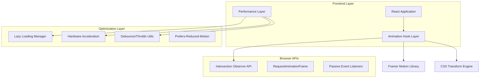
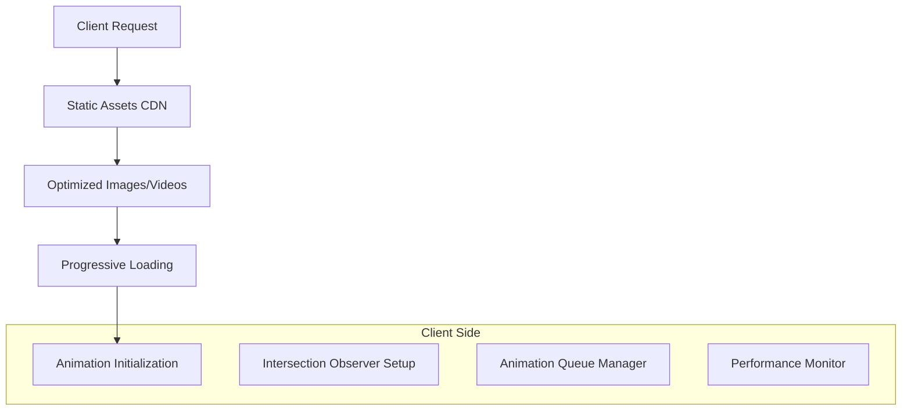
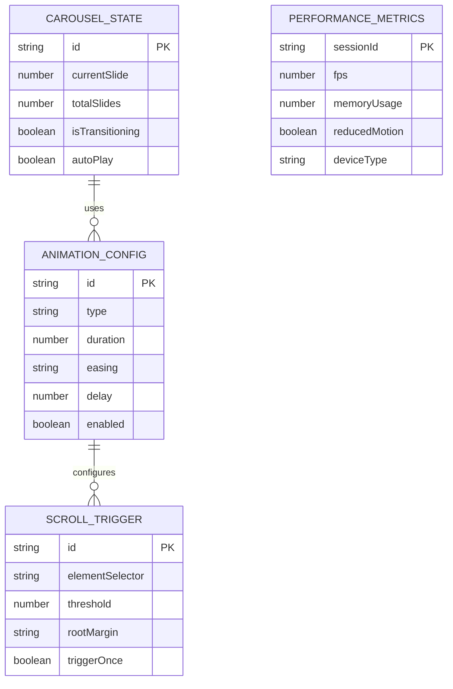

# Arsitektur Teknis Animasi Interaktif - Islamic Chronicle Quest

## 1. Desain Arsitektur



## 2. Deskripsi Teknologi

- **Frontend**: React@18 + TypeScript + Tailwind CSS + Framer Motion
- **Animation Library**: Framer Motion@10 (untuk complex animations) + CSS Transitions (untuk simple effects)
- **Performance**: Intersection Observer API + RequestAnimationFrame + Passive Event Listeners
- **Optimization**: React.memo + useMemo + useCallback untuk prevent re-renders

## 3. Definisi Route

| Route | Tujuan | Animasi Khusus |
|-------|--------|----------------|
| / | Halaman utama dengan hero parallax dan scroll reveals | Hero parallax, staggered card animations, floating particles |
| /timeline | Timeline dengan progressive loading dan scroll indicators | Progressive event loading, scroll progress bar, modal transitions |
| /quiz | Quiz dengan smooth transitions antar pertanyaan | Question slide transitions, progress animations, feedback effects |
| /about | About page dengan section reveals | Team section staggered reveals, mission parallax |
| /settings | Settings dengan accordion animations | Smooth accordion expand/collapse, form focus effects |

## 4. Definisi API dan Hooks

### 4.1 Custom Hooks

**useScrollAnimation Hook**
```typescript
interface ScrollAnimationOptions {
  threshold?: number;
  rootMargin?: string;
  triggerOnce?: boolean;
  stagger?: number;
}

const useScrollAnimation = (options: ScrollAnimationOptions) => {
  // Returns: { ref, isVisible, controls }
}
```

**useCarouselAnimation Hook**
```typescript
interface CarouselOptions {
  autoPlay?: boolean;
  duration?: number;
  easing?: string;
  infinite?: boolean;
  touchEnabled?: boolean;
}

const useCarouselAnimation = (options: CarouselOptions) => {
  // Returns: { currentSlide, nextSlide, prevSlide, isTransitioning }
}
```

**usePerformanceOptimization Hook**
```typescript
const usePerformanceOptimization = () => {
  // Returns: { prefersReducedMotion, isLowEndDevice, shouldAnimate }
}
```

### 4.2 Animation Utilities

**Intersection Observer Manager**
```typescript
class IntersectionManager {
  observe(element: Element, callback: Function, options?: IntersectionObserverInit): void
  unobserve(element: Element): void
  disconnect(): void
}
```

**Animation Controller**
```typescript
interface AnimationConfig {
  duration: number;
  easing: string;
  delay?: number;
  stagger?: number;
}

class AnimationController {
  fadeIn(element: Element, config: AnimationConfig): Promise<void>
  slideUp(element: Element, config: AnimationConfig): Promise<void>
  scaleIn(element: Element, config: AnimationConfig): Promise<void>
  staggerChildren(container: Element, config: AnimationConfig): Promise<void>
}
```

## 5. Arsitektur Server

Tidak diperlukan arsitektur server khusus karena semua animasi berjalan di client-side. Namun, optimasi loading:



## 6. Model Data

### 6.1 Definisi Model Data



### 6.2 Data Definition Language

**Animation Configuration**
```typescript
// Animation configuration types
interface AnimationConfig {
  id: string;
  type: 'fadeIn' | 'slideUp' | 'scaleIn' | 'parallax' | 'carousel';
  duration: number; // in milliseconds
  easing: string; // CSS easing function
  delay?: number;
  stagger?: number;
  enabled: boolean;
}

// Scroll trigger configuration
interface ScrollTrigger {
  id: string;
  elementSelector: string;
  threshold: number; // 0-1
  rootMargin: string; // CSS margin syntax
  triggerOnce: boolean;
  animationConfig: AnimationConfig;
}

// Carousel state management
interface CarouselState {
  id: string;
  currentSlide: number;
  totalSlides: number;
  isTransitioning: boolean;
  autoPlay: boolean;
  autoPlayInterval?: number;
  touchStartX?: number;
  touchEndX?: number;
}

// Performance monitoring
interface PerformanceMetrics {
  sessionId: string;
  fps: number;
  memoryUsage: number;
  reducedMotion: boolean;
  deviceType: 'mobile' | 'tablet' | 'desktop';
  connectionSpeed: 'slow' | 'fast';
}

// Default configurations
const DEFAULT_ANIMATIONS: Record<string, AnimationConfig> = {
  fadeIn: {
    id: 'fadeIn',
    type: 'fadeIn',
    duration: 600,
    easing: 'cubic-bezier(0.4, 0.0, 0.2, 1)',
    enabled: true
  },
  slideUp: {
    id: 'slideUp',
    type: 'slideUp',
    duration: 800,
    easing: 'cubic-bezier(0.0, 0.0, 0.2, 1)',
    delay: 100,
    enabled: true
  },
  carousel: {
    id: 'carousel',
    type: 'carousel',
    duration: 500,
    easing: 'cubic-bezier(0.4, 0.0, 0.2, 1)',
    enabled: true
  }
};

// CSS Custom Properties for animations
const CSS_ANIMATION_VARS = `
:root {
  --animation-duration-fast: 300ms;
  --animation-duration-normal: 600ms;
  --animation-duration-slow: 800ms;
  --animation-easing-ease-out: cubic-bezier(0.0, 0.0, 0.2, 1);
  --animation-easing-ease-in: cubic-bezier(0.4, 0.0, 1, 1);
  --animation-easing-ease-in-out: cubic-bezier(0.4, 0.0, 0.2, 1);
  --animation-stagger-delay: 100ms;
}

@media (prefers-reduced-motion: reduce) {
  :root {
    --animation-duration-fast: 0ms;
    --animation-duration-normal: 0ms;
    --animation-duration-slow: 0ms;
  }
}
`;
```