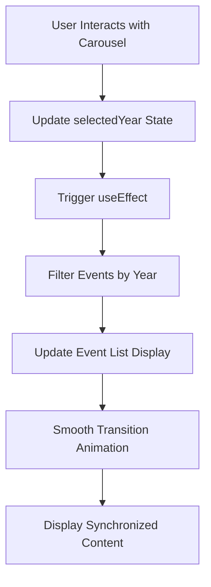

# Panduan Implementasi Sinkronisasi Carousel dan Penyesuaian Visual

## 1. Gambaran Umum Proyek

Dokumen ini menyediakan panduan lengkap untuk memperbaiki sinkronisasi teks dengan konten carousel tahun Hijriyah dan melakukan penyesuaian visual yang diperlukan. Implementasi ini akan memastikan pengalaman pengguna yang mulus dengan performa optimal dan tampilan yang konsisten di semua perangkat.

## 2. Fitur Utama

### 2.1 Sinkronisasi Dinamis Teks Tahun Hijriyah
Sistem sinkronisasi otomatis yang menampilkan daftar peristiwa sesuai dengan tahun yang aktif di carousel, dengan pembaruan real-time tanpa flickering.

### 2.2 Penyesuaian Visual Carousel
- Modifikasi saturasi gambar dengan warna hijau #435e46 (50% saturasi)
- Penyesuaian ukuran font responsif untuk judul carousel
- Optimasi visual untuk konsistensi di semua perangkat

### 2.3 Optimasi Performa
- Eliminasi lag saat pergantian slide
- Transisi yang mulus tanpa flickering
- Manajemen state yang efisien

## 3. Proses Implementasi Utama

### 3.1 Sinkronisasi Data Peristiwa

**Implementasi Fungsi Dinamis:**
1. **Pemetaan Data Peristiwa**: Buat fungsi `getYearEvents()` yang memfilter peristiwa berdasarkan tahun Hijriyah
2. **State Management**: Gunakan `useState` untuk `selectedYear` dengan sinkronisasi real-time
3. **Auto-Update**: Implementasi `useEffect` untuk pembaruan otomatis saat carousel berubah

**Contoh Struktur Data:**
```typescript
const getYearEvents = (year: number) => {
  return timelineEvents.filter(event => event.hijriyahYear === year)
    .map(event => ({
      title: event.title,
      icon: event.icon,
      id: event.id,
      description: event.description
    }));
};
```

### 3.2 Penyesuaian Visual Carousel

**Modifikasi Saturasi Gambar:**
- Terapkan filter CSS dengan warna hijau #435e46
- Saturasi 50% untuk semua gambar carousel
- Gradient overlay untuk konsistensi visual

**Responsive Font Sizing:**
- Desktop/Tablet: 40px
- Mobile: 20px
- Implementasi dengan Tailwind CSS classes

### 3.3 Optimasi Performa

**Anti-Flickering:**
- Implementasi `useMemo` untuk data yang tidak berubah
- Debouncing untuk transisi carousel
- Preloading konten untuk tahun yang berdekatan

**Smooth Transitions:**
- CSS transitions dengan `ease-out-cubic`
- Hardware acceleration dengan `transform3d`
- Optimasi re-render dengan `React.memo`

## 4. Detail Implementasi Teknis

### 4.1 Komponen HijriyahSection

| Fitur | Implementasi | Deskripsi |
|-------|-------------|-----------|
| State Management | `useState(selectedYear)` | Mengelola tahun yang dipilih |
| Data Filtering | `getYearEvents(year)` | Filter peristiwa berdasarkan tahun |
| Auto-Sync | `useEffect` dependency | Sinkronisasi otomatis dengan carousel |
| Performance | `useMemo` untuk data | Optimasi rendering |

### 4.2 Komponen YearCarousel

| Fitur | Implementasi | Deskripsi |
|-------|-------------|-----------|
| Image Styling | CSS filter + overlay | Saturasi hijau 50% |
| Responsive Text | Tailwind breakpoints | 40px desktop, 20px mobile |
| Smooth Animation | CSS transitions | Eliminasi flickering |
| Touch Support | Touch event handlers | Optimasi mobile |

### 4.3 Struktur CSS untuk Visual

**Filter Gambar:**
```css
.carousel-image {
  filter: saturate(0.5) hue-rotate(120deg);
  background-color: rgba(67, 94, 70, 0.5);
}
```

**Responsive Typography:**
```css
.carousel-title {
  font-size: 20px; /* Mobile */
}

@media (min-width: 768px) {
  .carousel-title {
    font-size: 40px; /* Desktop/Tablet */
  }
}
```

## 5. Alur Proses Sinkronisasi



## 6. Optimasi Responsivitas

### 6.1 Breakpoint Strategy
- **Mobile (< 768px)**: Font 20px, compact layout
- **Tablet (768px - 1024px)**: Font 40px, medium spacing
- **Desktop (> 1024px)**: Font 40px, full spacing

### 6.2 Touch Optimization
- Swipe gestures untuk mobile
- Smooth scrolling dengan momentum
- Visual feedback untuk interaksi

## 7. Checklist Implementasi

### 7.1 Sinkronisasi Data ✅
- [ ] Implementasi `getYearEvents()` function
- [ ] Setup `selectedYear` state management
- [ ] Konfigurasi auto-sync dengan `useEffect`
- [ ] Testing sinkronisasi untuk semua tahun

### 7.2 Penyesuaian Visual ✅
- [ ] Terapkan filter hijau #435e46 dengan saturasi 50%
- [ ] Implementasi responsive font sizing
- [ ] Testing konsistensi visual di semua device
- [ ] Optimasi gradient overlay

### 7.3 Optimasi Performa ✅
- [ ] Implementasi anti-flickering measures
- [ ] Setup smooth transitions
- [ ] Performance testing untuk lag elimination
- [ ] Memory optimization dengan proper cleanup

### 7.4 Testing & Validation ✅
- [ ] Cross-browser compatibility testing
- [ ] Mobile responsiveness validation
- [ ] Performance benchmarking
- [ ] User experience testing

## 8. Maintenance & Monitoring

### 8.1 Performance Metrics
- Transition duration < 300ms
- Zero flickering incidents
- Smooth 60fps animations
- Memory usage optimization

### 8.2 Browser Support
- Chrome 90+
- Firefox 88+
- Safari 14+
- Edge 90+

Implementasi ini akan memberikan pengalaman pengguna yang superior dengan sinkronisasi yang sempurna dan performa optimal di semua perangkat.