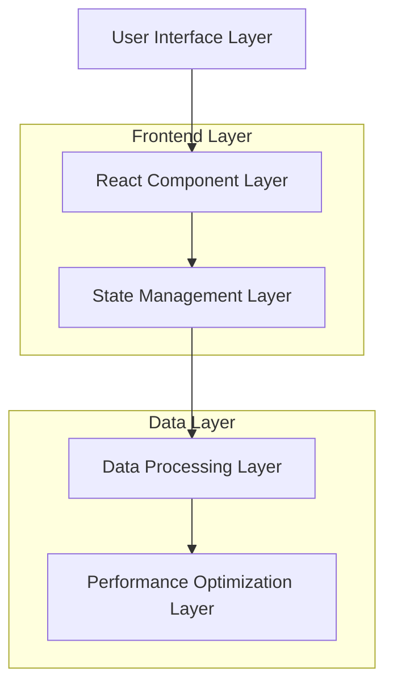
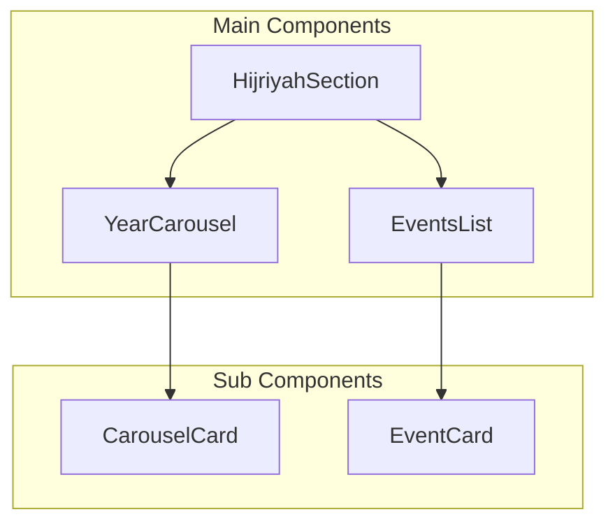
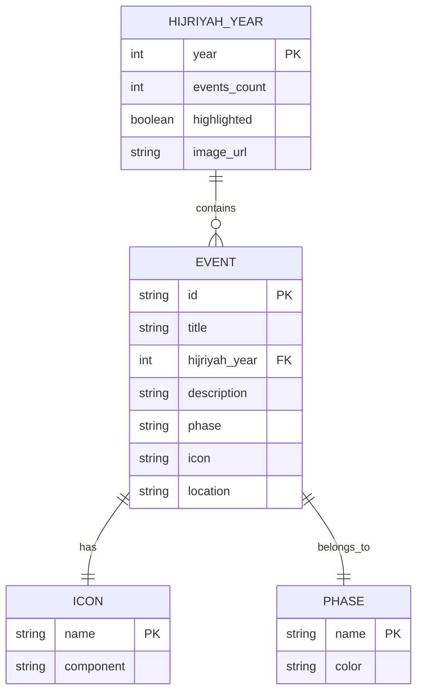

# Arsitektur Teknis Carousel Sinkronisasi

## 1. Desain Arsitektur



## 2. Deskripsi Teknologi

- Frontend: React@18 + TypeScript + Tailwind CSS
- State Management: React Hooks (useState, useEffect, useMemo)
- Animation: CSS Transitions + AOS Library
- Performance: React.memo + useMemo optimizations

## 3. Definisi Route

| Route | Tujuan |
|-------|--------|
| /home | Halaman utama dengan carousel tahun Hijriyah |
| /timeline | Halaman timeline detail dengan filter tahun |

## 4. Definisi API Internal

### 4.1 Core Functions

**Data Synchronization**
```typescript
// Function untuk sinkronisasi data peristiwa
function getYearEvents(year: number): EventData[]

// Parameters
| Param Name | Param Type | isRequired | Description |
|------------|------------|------------|-------------|
| year       | number     | true       | Tahun Hijriyah yang dipilih |

// Response
| Param Name | Param Type | Description |
|------------|------------|-------------|
| events     | EventData[] | Array peristiwa untuk tahun tersebut |
```

**Visual Configuration**
```typescript
// Function untuk konfigurasi visual carousel
function getCarouselStyles(selectedYear: number): StyleConfig

// Parameters
| Param Name    | Param Type | isRequired | Description |
|---------------|------------|------------|-------------|
| selectedYear  | number     | true       | Tahun yang aktif di carousel |

// Response
| Param Name | Param Type | Description |
|------------|------------|-------------|
| imageFilter | string     | CSS filter untuk saturasi hijau |
| fontSize    | string     | Ukuran font responsif |
| transition  | string     | Konfigurasi animasi |
```

## 5. Arsitektur Komponen



## 6. Model Data

### 6.1 Definisi Model Data



### 6.2 Data Definition Language

**Struktur Data Tahun Hijriyah**
```typescript
interface HijriyahYearData {
  year: number;
  events: number;
  highlighted: boolean;
  image: string;
}

// Contoh data
const hijriyahYears: HijriyahYearData[] = [
  {
    year: 0,
    events: timelineEvents.filter(event => event.hijriyahYear === 0).length,
    highlighted: false,
    image: hijriyah0
  },
  {
    year: 1,
    events: timelineEvents.filter(event => event.hijriyahYear === 1).length,
    highlighted: false,
    image: hijriyah1
  }
];
```

**Struktur Data Peristiwa**
```typescript
interface EventData {
  id: string;
  title: string;
  hijriyahYear: number;
  description: string;
  facts: string;
  phase: 'pra-kenabian' | 'makkah' | 'madinah';
  icon: LucideIcon;
  location: string;
  parties: string[];
}

// Fungsi filter peristiwa
const getYearEvents = (year: number): EventData[] => {
  return timelineEvents.filter(event => event.hijriyahYear === year);
};
```

**Konfigurasi Visual**
```typescript
interface VisualConfig {
  imageFilter: {
    saturate: string;
    hueRotate: string;
    overlay: string;
  };
  typography: {
    mobile: string;
    tablet: string;
    desktop: string;
  };
  transitions: {
    duration: string;
    easing: string;
    properties: string[];
  };
}

// Implementasi konfigurasi
const visualConfig: VisualConfig = {
  imageFilter: {
    saturate: '0.5',
    hueRotate: '120deg',
    overlay: 'rgba(67, 94, 70, 0.5)'
  },
  typography: {
    mobile: '20px',
    tablet: '40px',
    desktop: '40px'
  },
  transitions: {
    duration: '0.3s',
    easing: 'ease-out-cubic',
    properties: ['transform', 'opacity', 'filter']
  }
};
```

**State Management Schema**
```typescript
interface CarouselState {
  selectedYear: number;
  isTransitioning: boolean;
  scrollPosition: number;
  viewportWidth: number;
}

// Hook untuk state management
const useCarouselState = () => {
  const [selectedYear, setSelectedYear] = useState<number>(0);
  const [isTransitioning, setIsTransitioning] = useState<boolean>(false);
  
  const currentEvents = useMemo(() => 
    getYearEvents(selectedYear), 
    [selectedYear]
  );
  
  return {
    selectedYear,
    setSelectedYear,
    isTransitioning,
    setIsTransitioning,
    currentEvents
  };
};
```

**Performance Optimization Schema**
```typescript
interface PerformanceConfig {
  memoization: {
    events: boolean;
    styles: boolean;
    components: boolean;
  };
  debouncing: {
    scrollDelay: number;
    transitionDelay: number;
  };
  preloading: {
    adjacentYears: boolean;
    imagePreload: boolean;
  };
}

// Implementasi optimasi
const performanceConfig: PerformanceConfig = {
  memoization: {
    events: true,
    styles: true,
    components: true
  },
  debouncing: {
    scrollDelay: 100,
    transitionDelay: 50
  },
  preloading: {
    adjacentYears: true,
    imagePreload: true
  }
};
```