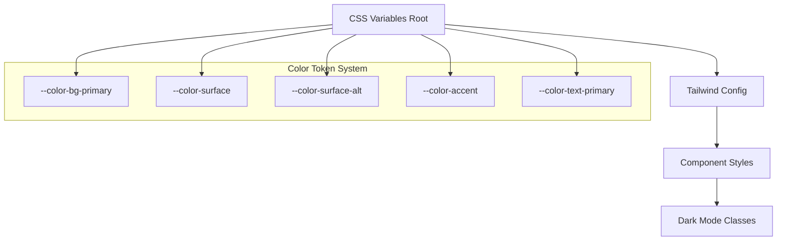

# Dark Mode Technical Implementation Guide
## Islamic Chronicle Quest - Panduan Teknis Implementasi

### 1. Architecture Overview



### 2. File Structure dan Dependencies

#### 2.1 Files to Modify

| File | Purpose | Priority |
|------|---------|----------|
| `src/index.css` | CSS Variables definition | High |
| `tailwind.config.ts` | Tailwind custom colors | High |
| `src/components/BottomNavigation.tsx` | Navigation consistency | High |
| `src/pages/Timeline.tsx` | Card backgrounds | Medium |
| `src/pages/Quiz.tsx` | Quiz interface colors | Medium |
| `src/components/InteractiveQuiz.tsx` | Quiz box styling | Medium |
| `src/pages/Settings.tsx` | Settings panel | Medium |
| `src/components/HeroSection.tsx` | Hero text contrast | Low |

#### 2.2 Dependencies Check

```json
{
  "dependencies": {
    "tailwindcss": "^3.x.x",
    "react": "^18.x.x"
  }
}
```

### 3. Step-by-Step Implementation

#### 3.1 Step 1: Setup CSS Variables

**File: `src/index.css`**

```css
/* Add to existing root variables */
:root {
  /* Existing light mode variables - DO NOT MODIFY */
  
  /* Dark Mode Color System */
  --color-bg-primary: #000000;
  --color-surface: #131300;
  --color-surface-alt: #ccc4b2;
  --color-accent: #435e46;
  --color-accent-hover: #4a6b4e;
  --color-text-primary: #ccc4b2;
  --color-text-secondary: rgba(204, 196, 178, 0.7);
  --color-text-on-beige: #131300;
  --color-border: rgba(67, 94, 70, 0.45);
  
  /* Navigation System */
  --color-nav-icon-default: rgba(204, 196, 178, 0.55);
  --color-nav-icon-active: #435e46;
  --color-nav-bg-active: rgba(67, 94, 70, 0.18);
  --color-nav-label-active: #ccc4b2;
  
  /* Transitions */
  --transition-colors: color 0.25s ease-in-out, background-color 0.25s ease-in-out, border-color 0.25s ease-in-out;
}

/* Dark mode application */
.dark {
  --bg-primary: var(--color-bg-primary);
  --bg-surface: var(--color-surface);
  --bg-surface-alt: var(--color-surface-alt);
  --text-primary: var(--color-text-primary);
  --text-secondary: var(--color-text-secondary);
  --text-on-beige: var(--color-text-on-beige);
  --accent: var(--color-accent);
  --accent-hover: var(--color-accent-hover);
  --border: var(--color-border);
}
```

#### 3.2 Step 2: Update Tailwind Config

**File: `tailwind.config.ts`**

```typescript
export default {
  // ... existing config
  theme: {
    extend: {
      colors: {
        // Existing colors - DO NOT MODIFY
        
        // Dark mode color system
        'dark-bg': {
          primary: 'var(--color-bg-primary)',
          surface: 'var(--color-surface)',
          'surface-alt': 'var(--color-surface-alt)',
        },
        'dark-text': {
          primary: 'var(--color-text-primary)',
          secondary: 'var(--color-text-secondary)',
          'on-beige': 'var(--color-text-on-beige)',
        },
        'dark-accent': {
          DEFAULT: 'var(--color-accent)',
          hover: 'var(--color-accent-hover)',
        },
        'dark-nav': {
          'icon-default': 'var(--color-nav-icon-default)',
          'icon-active': 'var(--color-nav-icon-active)',
          'bg-active': 'var(--color-nav-bg-active)',
          'label-active': 'var(--color-nav-label-active)',
        },
        'dark-border': 'var(--color-border)',
      },
      transitionProperty: {
        'colors': 'color, background-color, border-color',
      }
    }
  }
}
```

#### 3.3 Step 3: Component Refactoring Patterns

**Pattern 1: Navigation Icons**

```tsx
// Before
<Icon className="text-gray-400 dark:text-gray-300" />

// After
<Icon className="text-gray-400 dark:text-dark-nav-icon-default transition-colors" />

// Active state
<Icon className="text-islamic-teal dark:text-dark-nav-icon-active transition-colors" />
```

**Pattern 2: Card Backgrounds**

```tsx
// Before
<div className="bg-white dark:bg-gray-800">

// After
<div className="bg-white dark:bg-dark-bg-surface transition-colors">
```

**Pattern 3: Text on Beige Backgrounds**

```tsx
// Before
<div className="bg-[#ccc4b2] text-gray-800">

// After
<div className="bg-[#ccc4b2] text-dark-text-on-beige">
```

**Pattern 4: Interactive Elements**

```tsx
// Before
<button className="bg-islamic-teal hover:bg-islamic-teal/90">

// After
<button className="bg-islamic-teal dark:bg-dark-accent hover:bg-islamic-teal/90 dark:hover:bg-dark-accent-hover transition-colors">
```

### 4. Component-Specific Implementation

#### 4.1 BottomNavigation.tsx

**Focus Areas:**
- Icon colors consistency
- Active state backgrounds
- Label text colors

**Implementation:**
```tsx
// Navigation item structure
<div className={`
  flex flex-col items-center p-2 rounded-lg transition-colors
  ${isActive 
    ? 'bg-islamic-teal/10 dark:bg-dark-nav-bg-active' 
    : 'hover:bg-gray-100 dark:hover:bg-dark-bg-surface'
  }
`}>
  <Icon className={`
    h-6 w-6 transition-colors
    ${isActive 
      ? 'text-islamic-teal dark:text-dark-nav-icon-active' 
      : 'text-gray-600 dark:text-dark-nav-icon-default'
    }
  `} />
  <span className={`
    text-xs mt-1 transition-colors
    ${isActive 
      ? 'text-islamic-teal dark:text-dark-nav-label-active' 
      : 'text-gray-600 dark:text-dark-nav-icon-default'
    }
  `}>
    {label}
  </span>
</div>
```

#### 4.2 Timeline.tsx & Quiz.tsx Cards

**Focus Areas:**
- Card background hierarchy
- Text contrast on different backgrounds
- Border colors

**Implementation:**
```tsx
// Card container
<div className="
  bg-white dark:bg-dark-bg-surface 
  border border-gray-200 dark:border-dark-border
  transition-colors
">
  {/* Content with beige background */}
  <div className="bg-[#ccc4b2] p-4">
    <h3 className="text-dark-text-on-beige font-semibold">
      Title Text
    </h3>
    <p className="text-dark-text-on-beige/80">
      Description text
    </p>
  </div>
  
  {/* Content with dark background */}
  <div className="p-4">
    <p className="text-gray-800 dark:text-dark-text-primary transition-colors">
      Regular text content
    </p>
  </div>
</div>
```

#### 4.3 Interactive Elements

**Focus Areas:**
- Button states and hover effects
- Link colors
- Form elements

**Implementation:**
```tsx
// Primary button
<button className="
  bg-islamic-teal dark:bg-dark-accent
  hover:bg-islamic-teal/90 dark:hover:bg-dark-accent-hover
  text-white
  transition-colors duration-200
  px-4 py-2 rounded-lg
">
  Action Button
</button>

// Secondary button
<button className="
  bg-gray-100 dark:bg-dark-bg-surface
  hover:bg-gray-200 dark:hover:bg-dark-bg-surface/80
  text-gray-800 dark:text-dark-text-primary
  border border-gray-300 dark:border-dark-border
  transition-colors duration-200
  px-4 py-2 rounded-lg
">
  Secondary Action
</button>
```

### 5. Testing and Validation

#### 5.1 Automated Testing Script

```javascript
// contrast-test.js
const contrastRatios = {
  'text-on-dark': {
    background: '#000000',
    foreground: '#ccc4b2',
    expected: 15.8
  },
  'text-on-beige': {
    background: '#ccc4b2',
    foreground: '#131300',
    expected: 15.8
  },
  'accent-on-dark': {
    background: '#000000',
    foreground: '#435e46',
    expected: 4.8
  }
};

// Validation function
function validateContrast(bg, fg, expected) {
  // Implementation using color contrast calculation
  const ratio = calculateContrastRatio(bg, fg);
  return ratio >= expected;
}
```

#### 5.2 Manual Testing Checklist

**Visual Consistency:**
- [ ] All navigation icons use same color tokens
- [ ] Card backgrounds follow hierarchy (primary → surface → surface-alt)
- [ ] Text contrast meets WCAG AA standards
- [ ] Hover states are consistent across components
- [ ] Transitions are smooth (0.25s ease-in-out)

**Functional Testing:**
- [ ] Dark mode toggle works without layout shift
- [ ] No color conflicts (beige on beige, etc.)
- [ ] Interactive elements clearly distinguishable
- [ ] Focus states visible and accessible

### 6. Performance Considerations

#### 6.1 CSS Variables vs Tailwind Classes

**Pros of CSS Variables:**
- Runtime theme switching
- Consistent color management
- Easier maintenance

**Implementation Strategy:**
```css
/* Efficient variable usage */
.component {
  background-color: var(--bg-surface);
  color: var(--text-primary);
  border-color: var(--border);
  transition: var(--transition-colors);
}
```

#### 6.2 Bundle Size Impact

- CSS Variables add minimal overhead
- Tailwind purging removes unused classes
- Custom color tokens don't increase bundle size significantly

### 7. Maintenance and Updates

#### 7.1 Adding New Colors

**Process:**
1. Add CSS variable to `:root`
2. Update Tailwind config
3. Document usage in this guide
4. Test contrast ratios
5. Update components

**Example:**
```css
:root {
  --color-warning: #f59e0b;
  --color-warning-dark: #d97706;
}

.dark {
  --warning: var(--color-warning-dark);
}
```

#### 7.2 Debugging Color Issues

**Common Issues:**
1. **Inheritance problems**: Use CSS specificity correctly
2. **Contrast failures**: Always test with accessibility tools
3. **Inconsistent navigation**: Use shared color tokens
4. **Missing transitions**: Apply transition classes consistently

**Debug Tools:**
- Chrome DevTools Color Picker
- axe DevTools
- WebAIM Contrast Checker

### 8. Rollback Strategy

**If Issues Occur:**
1. Revert CSS variables in `index.css`
2. Restore original Tailwind config
3. Remove dark mode classes from components
4. Test light mode functionality

**Backup Files:**
- `index.css.backup`
- `tailwind.config.ts.backup`
- Component files with git history

---

**Implementation Timeline:**
- Phase 1 (CSS Setup): 1-2 hours
- Phase 2 (Component Updates): 4-6 hours  
- Phase 3 (Testing & Validation): 2-3 hours
- **Total Estimated Time**: 7-11 hours