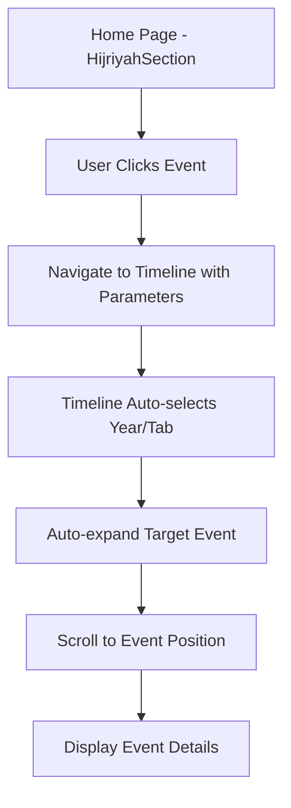

# Event Data Synchronization & Navigation Enhancement - Product Requirements Document

## 1. Product Overview

Proyek ini bertujuan untuk menyinkronkan data event antara halaman Home (HijriyahSection) dan halaman Timeline, serta meningkatkan fungsi navigasi untuk memberikan pengalaman pengguna yang lebih konsisten dan akurat.

Masalah utama yang ditemukan adalah ketidaksesuaian data event antara kedua halaman, dimana beberapa event di HijriyahSection tidak tersedia di timelineEvents, menyebabkan navigasi yang tidak berfungsi dengan baik.

Target utama adalah menciptakan sistem navigasi yang seamless dan data yang konsisten di seluruh aplikasi Islamic Chronicle Quest.

## 2. Core Features

### 2.1 User Roles
Tidak diperlukan pembedaan role untuk fitur ini, semua pengguna akan mendapat pengalaman yang sama.

### 2.2 Feature Module

Proyek sinkronisasi ini terdiri dari halaman-halaman utama berikut:
1. **Home Page (HijriyahSection)**: Menampilkan daftar event per tahun Hijriyah dengan navigasi ke Timeline
2. **Timeline Page**: Menampilkan detail lengkap event dengan kemampuan auto-expand berdasarkan navigasi dari Home
3. **Data Management**: Sistem sinkronisasi data event antara kedua halaman

### 2.3 Page Details

| Page Name | Module Name | Feature description |
|-----------|-------------|---------------------|
| Home Page | HijriyahSection Component | Menampilkan event per tahun Hijriyah. Sinkronisasi judul event dengan timelineEvents. Implementasi navigasi akurat ke Timeline dengan parameter yang tepat. |
| Timeline Page | Event Display & Navigation | Auto-expand event berdasarkan parameter dari Home. Pencarian event yang lebih akurat. Scroll otomatis ke event yang dipilih. |
| Data Layer | Event Data Synchronization | Sinkronisasi data antara hijriyahYears dan timelineEvents. Validasi konsistensi data. Mapping yang akurat antara event titles. |

## 3. Core Process

**User Flow untuk Navigasi Event:**
1. User membuka halaman Home dan melihat daftar event per tahun Hijriyah
2. User mengklik salah satu event (contoh: "Perang Bani An-Nadhir" di tahun 4 Hijriyah)
3. Sistem mengarahkan user ke halaman Timeline dengan parameter yang tepat
4. Timeline page otomatis menampilkan tab/tahun yang sesuai
5. Event yang dipilih otomatis ter-expand dan scroll ke posisi yang tepat
6. User dapat melihat detail lengkap event yang dipilih

**Data Synchronization Flow:**
1. Identifikasi semua event di HijriyahSection yang tidak ada di timelineEvents
2. Tambahkan event yang hilang ke timelineEvents dengan data yang lengkap
3. Sinkronisasi judul event agar konsisten antara kedua sumber data
4. Validasi mapping antara event titles dan IDs
5. Testing navigasi untuk memastikan semua event dapat diakses dengan benar

## 4. User Interface Design

### 4.1 Design Style
- **Primary Colors**: Tetap menggunakan skema warna hijau Islamic yang sudah ada (#435e46)
- **Button Style**: Rounded buttons dengan hover effects yang smooth
- **Font**: Inter font family dengan ukuran responsif (text-sm sm:text-base)
- **Layout Style**: Card-based layout dengan gradient backgrounds
- **Animation**: Smooth transitions (transition-all duration-300) untuk hover states dan navigasi

### 4.2 Page Design Overview

| Page Name | Module Name | UI Elements |
|-----------|-------------|-------------|
| Home Page | Event Cards | Card layout dengan icon, title, dan arrow indicator. Hover effects dengan shadow-elegant. Responsive spacing (p-3 sm:p-4). |
| Timeline Page | Event Expansion | Auto-expanded event cards dengan highlight. Smooth scroll animation ke target event. Visual feedback untuk active event. |
| Navigation | Parameter Handling | URL parameters untuk event dan year. Loading states selama navigasi. Error handling untuk event yang tidak ditemukan. |

### 4.3 Responsiveness
Aplikasi sudah mobile-first dengan breakpoints yang responsif (sm:, md:). Semua fitur navigasi dan sinkronisasi akan bekerja optimal di desktop dan mobile devices dengan touch interaction yang dioptimalkan.