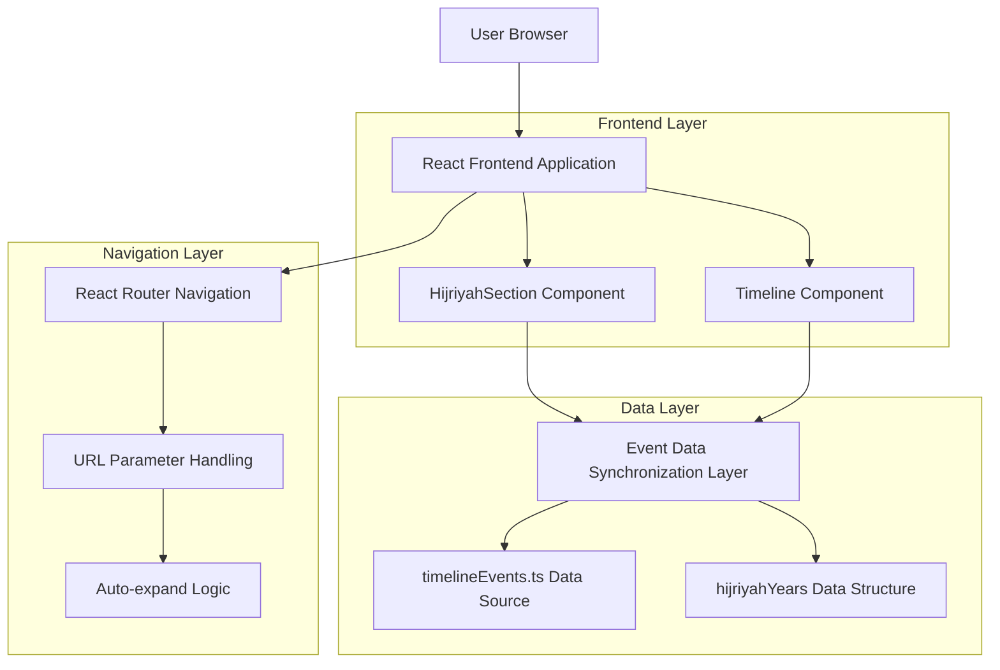
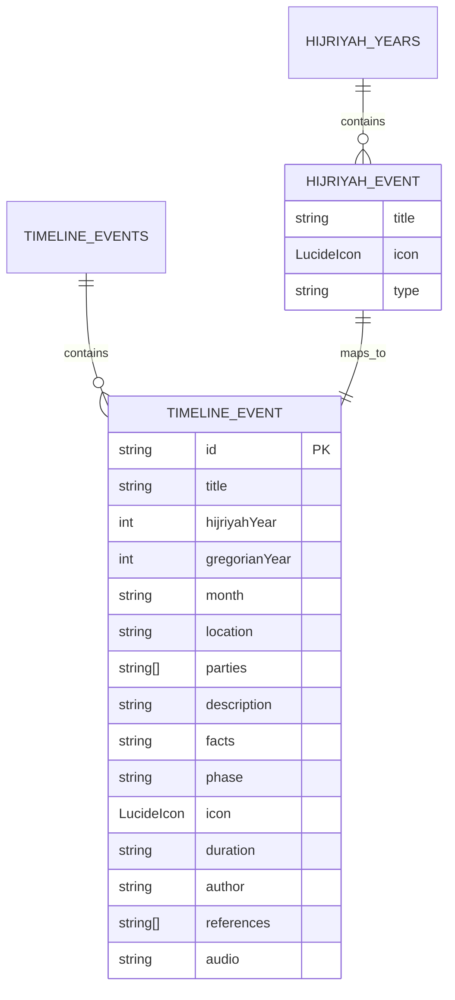

# Event Data Synchronization & Navigation Enhancement - Technical Architecture Document

## 1. Architecture Design



## 2. Technology Description

- **Frontend**: React@18 + TypeScript + Vite
- **Styling**: TailwindCSS@3 + Lucide React Icons
- **Navigation**: React Router DOM
- **State Management**: React useState + useEffect hooks
- **Data Source**: Static TypeScript files (timelineEvents.ts)

## 3. Route Definitions

| Route | Purpose |
|-------|---------|
| / | Home page dengan HijriyahSection component |
| /timeline | Timeline page dengan parameter support |
| /timeline?event={eventTitle}&year={hijriyahYear} | Timeline dengan auto-navigation ke specific event |
| /timeline?eventId={eventId} | Timeline dengan direct event ID navigation |

## 4. API Definitions

### 4.1 Core Data Structures

**Event Interface (timelineEvents.ts)**
```typescript
interface TimelineEvent {
  id: string;
  title: string;
  hijriyahYear: number;
  gregorianYear: number;
  month: string;
  location: string;
  parties: string[];
  description: string;
  facts: string;
  phase: 'pra-kenabian' | 'makkah' | 'madinah' | 'expansion';
  icon: LucideIcon;
  duration: string;
  author: string;
  references: string[];
  audio: string;
}
```

**HijriyahYear Event Structure**
```typescript
interface HijriyahEvent {
  title: string;
  icon: LucideIcon;
  type: 'battle' | 'personal' | 'religious' | 'expedition' | 'treaty' | 'conquest' | 'siege' | 'celebration' | 'trial' | 'leadership' | 'speech';
}

interface HijriyahYears {
  [year: number]: HijriyahEvent[];
}
```

### 4.2 Navigation Functions

**Event Click Handler**
```typescript
const handleEventClick = (title: string, year: number) => {
  navigate(`/timeline?event=${encodeURIComponent(title)}&year=${year}`);
};
```

**Timeline Parameter Processing**
```typescript
const useEffect(() => {
  const eventParam = searchParams.get('event');
  const yearParam = searchParams.get('year');
  
  if (eventParam && yearParam) {
    // Find matching event in timelineEvents
    const targetEvent = timelineEvents.find(event => 
      event.title.toLowerCase().includes(eventParam.toLowerCase()) &&
      event.hijriyahYear === parseInt(yearParam)
    );
    
    if (targetEvent) {
      // Auto-expand and scroll to event
      setExpandedEvents(new Set([targetEvent.id]));
      setSelectedYear(parseInt(yearParam));
      
      // Scroll to event after DOM update
      setTimeout(() => {
        const element = document.getElementById(targetEvent.id);
        element?.scrollIntoView({ behavior: 'smooth', block: 'center' });
      }, 500);
    }
  }
}, [searchParams]);
```

## 5. Data Model

### 5.1 Data Model Definition



### 5.2 Data Definition Language

**Missing Events for Year 4 Hijriyah (to be added to timelineEvents.ts)**
```typescript
// Events to be added to timelineEvents array
{
  id: 'perang-bani-nadhir',
  title: 'Perang Bani An-Nadhir',
  hijriyahYear: 4,
  gregorianYear: 625,
  month: 'Rabi\'ul Awwal',
  location: 'Madinah - Perkampungan Bani An-Nadhir',
  parties: ['Nabi Muhammad ﷺ dan kaum Muslim', 'Suku Yahudi Bani An-Nadhir'],
  description: 'Pengepungan dan pengusiran suku Yahudi Bani An-Nadhir dari Madinah setelah mereka melanggar perjanjian dan merencanakan pembunuhan terhadap Nabi Muhammad ﷺ.',
  facts: 'Peristiwa ini menghasilkan turunnya Surat Al-Hasyr yang mengatur hukum tentang harta rampasan perang.',
  phase: 'madinah',
  icon: Sword,
  duration: '15 hari',
  author: 'Ibnu Hisyam',
  references: ['Sirah Nabawiyah Ibnu Hisyam', 'Tafsir Ibnu Katsir Surat Al-Hasyr'],
  audio: ''
},
{
  id: 'wafat-zainab-khuzaimah',
  title: 'Wafatnya Zainab binti Khuzaimah',
  hijriyahYear: 4,
  gregorianYear: 625,
  month: 'Rabi\'ul Akhir',
  location: 'Madinah',
  parties: ['Zainab binti Khuzaimah', 'Nabi Muhammad ﷺ'],
  description: 'Wafatnya Zainab binti Khuzaimah, istri Nabi Muhammad ﷺ yang dikenal dengan sebutan "Ummul Masakin" karena kepeduliannya terhadap orang-orang miskin.',
  facts: 'Zainab binti Khuzaimah hanya menjadi istri Nabi selama 2-3 bulan sebelum wafat.',
  phase: 'madinah',
  icon: Heart,
  duration: '-',
  author: 'Ibnu Sa\'d',
  references: ['Tabaqat Ibnu Sa\'d'],
  audio: ''
},
{
  id: 'pernikahan-ummu-salamah',
  title: 'Pernikahan Nabi dengan Ummu Salamah',
  hijriyahYear: 4,
  gregorianYear: 625,
  month: 'Syawal',
  location: 'Madinah',
  parties: ['Nabi Muhammad ﷺ', 'Ummu Salamah (Hind binti Abi Umayyah)'],
  description: 'Pernikahan Nabi Muhammad ﷺ dengan Ummu Salamah setelah masa iddahnya berakhir dari suami sebelumnya, Abu Salamah, yang gugur dalam perang.',
  facts: 'Ummu Salamah adalah wanita yang sangat cerdas dan sering memberikan nasihat kepada Nabi Muhammad ﷺ.',
  phase: 'madinah',
  icon: Heart,
  duration: '-',
  author: 'Ibnu Hisyam',
  references: ['Sirah Nabawiyah Ibnu Hisyam'],
  audio: ''
},
{
  id: 'ekspedisi-dzat-riqa',
  title: 'Ekspedisi Dzat ar-Riqa',
  hijriyahYear: 4,
  gregorianYear: 625,
  month: 'Jumadil Ula',
  location: 'Dzat ar-Riqa (Najd)',
  parties: ['Nabi Muhammad ﷺ dan 400 sahabat', 'Suku Ghatafan dan Anmar'],
  description: 'Ekspedisi militer untuk menghadapi ancaman dari suku-suku Najd yang merencanakan serangan terhadap Madinah.',
  facts: 'Dalam ekspedisi ini pertama kali dilaksanakan shalat khauf (shalat dalam keadaan takut) karena situasi perang.',
  phase: 'madinah',
  icon: Sword,
  duration: '10 hari',
  author: 'Al-Waqidi',
  references: ['Maghazi Al-Waqidi'],
  audio: ''
},
{
  id: 'turunnya-ayat-hijab',
  title: 'Hukum Hijab Diturunkan',
  hijriyahYear: 4,
  gregorianYear: 625,
  month: 'Dzulhijjah',
  location: 'Madinah',
  parties: ['Nabi Muhammad ﷺ', 'Istri-istri Nabi', 'Kaum Muslim'],
  description: 'Turunnya ayat-ayat Al-Qur\'an yang mengatur tentang hijab bagi istri-istri Nabi dan wanita mukminah.',
  facts: 'Ayat hijab turun dalam Surat Al-Ahzab ayat 53 dan 59, mengatur etika berinteraksi dengan istri-istri Nabi.',
  phase: 'madinah',
  icon: Calendar,
  duration: '-',
  author: 'Imam At-Tabari',
  references: ['Tafsir At-Tabari'],
  audio: ''
}

// Data Synchronization Mapping
const eventTitleMapping = {
  // HijriyahSection title -> timelineEvents title
  'Perang Bani An-Nadhir': 'Perang Bani An-Nadhir',
  'Wafatnya Zainab binti Khuzaimah': 'Wafatnya Zainab binti Khuzaimah',
  'Pernikahan Nabi dengan Ummu Salamah': 'Pernikahan Nabi dengan Ummu Salamah',
  'Ekspedisi Dzat ar-Riqa': 'Ekspedisi Dzat ar-Riqa',
  'Hukum Hijab Diturunkan': 'Hukum Hijab Diturunkan'
};

// Enhanced search function for better event matching
const findEventByTitle = (title: string, year: number): TimelineEvent | undefined => {
  return timelineEvents.find(event => {
    const normalizedEventTitle = event.title.toLowerCase().trim();
    const normalizedSearchTitle = title.toLowerCase().trim();
    
    return (
      event.hijriyahYear === year &&
      (normalizedEventTitle === normalizedSearchTitle ||
       normalizedEventTitle.includes(normalizedSearchTitle) ||
       normalizedSearchTitle.includes(normalizedEventTitle))
    );
  });
};
```

**Implementation Steps:**
1. Add missing events to timelineEvents.ts for year 4 Hijriyah
2. Update HijriyahSection event titles to match timelineEvents exactly
3. Enhance event search and matching logic in Timeline component
4. Add validation to ensure all HijriyahSection events exist in timelineEvents
5. Implement comprehensive testing for navigation functionality