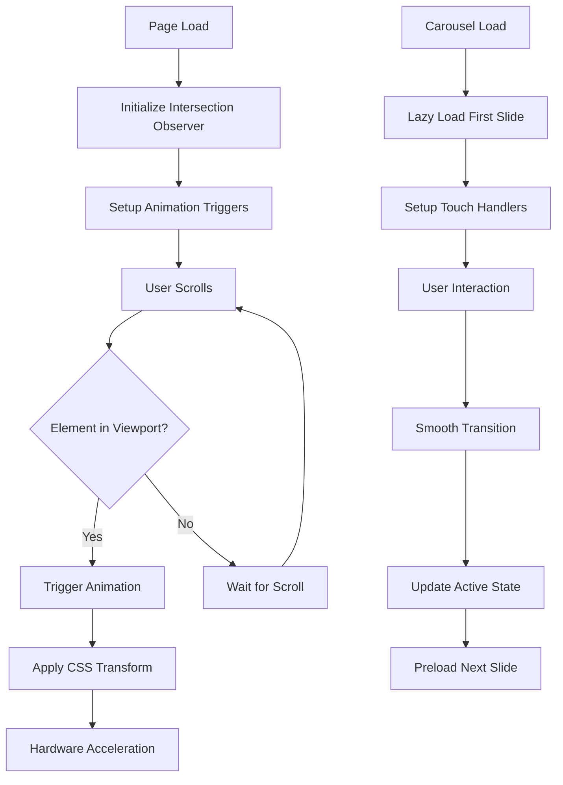

# Panduan Implementasi Animasi Interaktif - Islamic Chronicle Quest

## 1. Gambaran Umum Proyek

Implementasi sistem animasi interaktif yang halus dan responsif untuk meningkatkan pengalaman pengguna pada aplikasi Islamic Chronicle Quest. Fokus pada animasi scroll, transisi carousel, dan optimasi performa untuk memastikan pengalaman yang lancar tanpa mengorbankan kecepatan loading halaman.

## 2. Fitur Utama

### 2.1 Peran Pengguna
Tidak diperlukan pembedaan peran khusus untuk fitur animasi ini - semua pengguna akan mendapatkan pengalaman animasi yang sama.

### 2.2 Modul Fitur

Implementasi animasi interaktif terdiri dari halaman dan komponen berikut:
1. **Halaman Utama (Index)**: Animasi scroll reveal, parallax hero section, smooth transitions
2. **Timeline**: Animasi progresif untuk event cards, scroll-triggered animations
3. **Quiz**: Transisi halus antar pertanyaan, feedback animations
4. **About**: Fade-in animations untuk section content
5. **Settings**: Smooth transitions untuk accordion dan form elements
6. **Komponen Carousel**: Smooth sliding transitions, touch gestures, lazy loading

### 2.3 Detail Halaman

| Nama Halaman | Nama Modul | Deskripsi Fitur |
|--------------|------------|-----------------|
| Index | Hero Section Animation | Parallax background, fade-in text dengan stagger effect, floating particles |
| Index | Scroll Reveal Cards | Progressive reveal untuk historical phases, intersection observer |
| Index | Search Animation | Smooth focus transitions, dropdown slide animations |
| Timeline | Progressive Loading | Lazy load timeline events dengan fade-in animation |
| Timeline | Scroll Progress | Visual progress indicator dengan smooth transitions |
| Timeline | Event Cards | Hover animations, click transitions, modal slide-in |
| Quiz | Question Transitions | Smooth slide transitions antar pertanyaan, progress bar animation |
| Quiz | Answer Feedback | Success/error animations, explanation reveal transitions |
| About | Section Reveals | Staggered fade-in untuk team sections, parallax elements |
| Settings | Accordion Animations | Smooth expand/collapse, form field focus animations |
| Carousel Components | Slide Transitions | Hardware-accelerated sliding, touch gesture support |
| Carousel Components | Navigation Controls | Hover effects, active state animations, loading indicators |

## 3. Alur Proses Utama

### Alur Animasi Scroll
1. Pengguna membuka halaman → Animasi loading initial
2. Pengguna scroll ke bawah → Elemen muncul secara progresif dengan intersection observer
3. Elemen masuk viewport → Trigger animasi fade-in/slide-up dengan stagger
4. Pengguna hover pada elemen → Smooth hover transitions
5. Pengguna scroll kembali ke atas → Reverse animations (opsional)

### Alur Animasi Carousel
1. Carousel dimuat → Lazy load slide pertama dengan fade-in
2. Pengguna navigasi (click/swipe) → Smooth slide transition dengan easing
3. Slide baru masuk → Progressive loading konten dengan skeleton
4. Auto-play aktif → Smooth automatic transitions dengan pause on hover

## 4. Desain Antarmuka Pengguna

### 4.1 Gaya Desain
- **Warna Utama**: #435e46 (Islamic Green) untuk accent animations
- **Warna Sekunder**: #d4af37 (Islamic Gold) untuk highlight effects
- **Gaya Animasi**: Smooth, organic easing (cubic-bezier(0.4, 0.0, 0.2, 1))
- **Durasi**: 300-600ms untuk micro-interactions, 800-1200ms untuk page transitions
- **Easing Functions**: 
  - Entrance: `ease-out` atau `cubic-bezier(0.0, 0.0, 0.2, 1)`
  - Exit: `ease-in` atau `cubic-bezier(0.4, 0.0, 1, 1)`
  - Emphasis: `ease-in-out` atau `cubic-bezier(0.4, 0.0, 0.2, 1)`

### 4.2 Gambaran Desain Halaman

| Nama Halaman | Nama Modul | Elemen UI |
|--------------|------------|-----------|
| Index | Hero Animation | Gradient overlay fade-in (800ms), title slide-up dengan stagger (600ms), CTA button scale-in (400ms) |
| Index | Cards Reveal | Intersection observer trigger, transform: translateY(50px) to translateY(0), opacity: 0 to 1 |
| Timeline | Event Animation | Progressive reveal dengan delay increment 100ms, hover scale(1.02), active state glow |
| Quiz | Transition Effects | Slide-left exit (300ms), slide-right enter (300ms), progress bar width animation |
| Carousel | Slide Animation | Transform: translateX dengan hardware acceleration, touch momentum, elastic bounce |

### 4.3 Responsivitas

Aplikasi menggunakan pendekatan mobile-first dengan optimasi animasi:
- **Desktop**: Full animation effects dengan parallax dan complex transitions
- **Tablet**: Reduced motion untuk parallax, maintained smooth transitions
- **Mobile**: Simplified animations, respect `prefers-reduced-motion`, touch-optimized gestures
- **Accessibility**: Automatic disable untuk users dengan `prefers-reduced-motion: reduce`