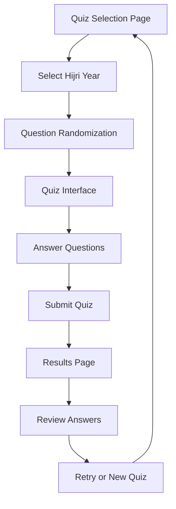

# Quiz System - Product Requirements Document

## 1. Product Overview

An interactive Islamic history quiz system that organizes questions by Hijri years, featuring dynamic question selection and progress tracking to enhance learning about Islamic historical events.

The system addresses the need for engaging educational tools that help users learn Islamic history through structured quizzes while maintaining variety and preventing repetition across multiple attempts.

This product targets Islamic education platforms, madrasas, and individual learners seeking to deepen their knowledge of Islamic historical events in an interactive format.

## 2. Core Features

### 2.1 User Roles

| Role | Registration Method | Core Permissions |
|------|---------------------|------------------|
| Quiz Taker | No registration required | Can take quizzes, view scores, track progress |
| Guest User | Direct access | Limited to single quiz attempts without progress tracking |

### 2.2 Feature Module

Our quiz system consists of the following main pages:
1. **Quiz Selection Page**: Hijri year selection, quiz statistics, progress overview
2. **Quiz Interface Page**: Question display, answer selection, navigation controls, timer
3. **Results Page**: Score display, correct answers review, performance analytics
4. **Question Bank Management**: Admin interface for question pool management

### 2.3 Page Details

| Page Name | Module Name | Feature description |
|-----------|-------------|---------------------|
| Quiz Selection Page | Year Selector | Display available Hijri years with question counts and completion status |
| Quiz Selection Page | Progress Tracker | Show user's quiz history, scores, and completion statistics |
| Quiz Selection Page | Statistics Panel | Display overall performance metrics and learning progress |
| Quiz Interface Page | Question Display | Present questions with multiple choice options (A, B, C, D) |
| Quiz Interface Page | Answer Selection | Allow users to select and change answers before submission |
| Quiz Interface Page | Navigation Controls | Provide next/previous buttons and question number navigation |
| Quiz Interface Page | Progress Indicator | Show current question number and overall quiz progress |
| Quiz Interface Page | Timer Module | Optional countdown timer for timed quiz modes |
| Results Page | Score Calculator | Calculate and display final score with percentage |
| Results Page | Answer Review | Show correct answers alongside user's responses |
| Results Page | Performance Analytics | Provide detailed breakdown of performance by topic |
| Results Page | Retry Options | Allow users to retake quiz with different question set |
| Question Bank Management | Question Pool | Manage 20 questions per Hijri year with randomization logic |
| Question Bank Management | Usage Tracking | Track which questions have been used to ensure variety |

## 3. Core Process

**Main User Flow:**
1. User accesses the quiz selection page
2. User selects a Hijri year (starting with 2 Hijriyah)
3. System randomly selects 10 questions from the 20 available questions
4. User answers questions sequentially or navigates freely
5. User submits quiz for scoring
6. System displays results with correct answers and performance metrics
7. User can retry with a different set of questions or select another year

**Question Randomization Flow:**
1. System identifies available question pool for selected year
2. Algorithm checks previously used questions from local storage
3. System selects 10 unused questions, or mixes used/unused if needed
4. Questions are shuffled and presented to user
5. Used questions are marked in tracking system

## 4. User Interface Design

### 4.1 Design Style

- **Primary Colors**: Islamic Gold (#B4983A), Deep Green (#2D5016)
- **Secondary Colors**: Cream (#F5F5DC), White (#FFFFFF)
- **Button Style**: Rounded corners with subtle shadows and hover effects
- **Font**: Clean, readable fonts with Arabic-friendly typography
- **Layout Style**: Card-based design with Islamic geometric patterns
- **Icons**: Islamic-themed icons with crescent and star motifs

### 4.2 Page Design Overview

| Page Name | Module Name | UI Elements |
|-----------|-------------|-------------|
| Quiz Selection Page | Year Selector | Card-based layout with Islamic gold borders, year badges with completion indicators |
| Quiz Selection Page | Progress Tracker | Circular progress indicators, achievement badges, statistics cards |
| Quiz Interface Page | Question Display | Clean question cards with Islamic border patterns, numbered question indicators |
| Quiz Interface Page | Answer Options | Radio button styled as Islamic geometric shapes, hover effects with gold highlighting |
| Quiz Interface Page | Navigation | Islamic-styled previous/next buttons, breadcrumb navigation with Arabic numerals |
| Results Page | Score Display | Large circular score indicator with Islamic calligraphy styling |
| Results Page | Answer Review | Side-by-side comparison cards with color-coded correct/incorrect indicators |

### 4.3 Responsiveness

Desktop-first design with mobile-adaptive layout. Touch-optimized for tablet and mobile devices with larger touch targets for answer selection and navigation controls.