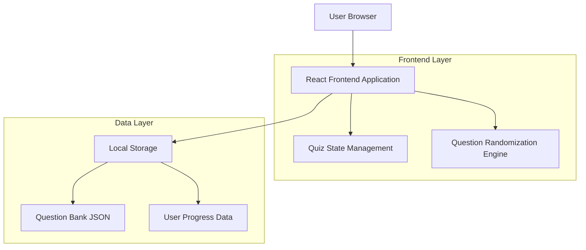
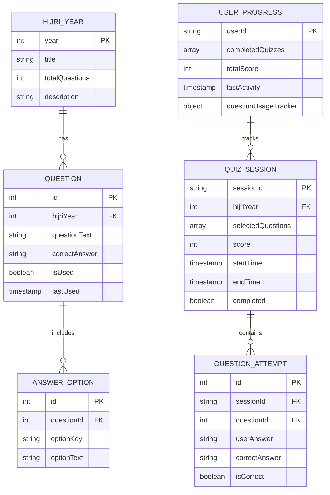
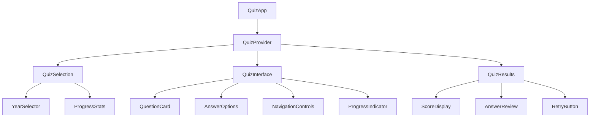

# Quiz System - Technical Architecture Document

## 1. Architecture Design



## 2. Technology Description

- Frontend: React@18 + TypeScript + TailwindCSS + Vite
- State Management: React Context API + useReducer
- Data Storage: Local Storage for user progress and question tracking
- Styling: TailwindCSS with custom Islamic theme configuration

## 3. Route Definitions

| Route | Purpose |
|-------|---------|
| /quiz | Quiz selection page with Hijri year options |
| /quiz/:year | Active quiz interface for specific Hijri year |
| /quiz/:year/results | Results page showing score and answer review |
| /quiz/history | User's quiz history and progress tracking |

## 4. Data Model

### 4.1 Data Model Definition



### 4.2 Data Definition Language

**Question Bank Structure (TypeScript Interfaces)**

```typescript
interface HijriYear {
  year: number;
  title: string;
  totalQuestions: number;
  description: string;
}

interface Question {
  id: number;
  hijriYear: number;
  questionText: string;
  options: AnswerOption[];
  correctAnswer: 'A' | 'B' | 'C' | 'D';
  category?: string;
  difficulty?: 'easy' | 'medium' | 'hard';
}

interface AnswerOption {
  key: 'A' | 'B' | 'C' | 'D';
  text: string;
}

interface QuizSession {
  sessionId: string;
  hijriYear: number;
  selectedQuestions: Question[];
  userAnswers: Record<number, string>;
  score: number;
  startTime: Date;
  endTime?: Date;
  completed: boolean;
}

interface UserProgress {
  userId: string;
  completedQuizzes: QuizSession[];
  totalScore: number;
  lastActivity: Date;
  questionUsageTracker: Record<number, {
    usageCount: number;
    lastUsed: Date;
  }>;
}
```

**Initial Data Structure for 2 Hijriyah Questions**

```typescript
const hijriyah2Questions: Question[] = [
  {
    id: 0,
    hijriYear: 2,
    questionText: "Perang Abwa termasuk jenis peperangan apa?",
    options: [
      { key: 'A', text: 'Sarriyah' },
      { key: 'B', text: 'Ghazwah' },
      { key: 'C', text: 'Fathu' },
      { key: 'D', text: 'Futuhat' }
    ],
    correctAnswer: 'B',
    category: 'Perang Abwa'
  },
  {
    id: 1,
    hijriYear: 2,
    questionText: "Waddan disebut juga Abwa karena letaknya berdekatan di antara…",
    options: [
      { key: 'A', text: 'Thaif dan Madinah' },
      { key: 'B', text: 'Khaibar dan Madinah' },
      { key: 'C', text: 'Mekah dan Madinah' },
      { key: 'D', text: 'Hunain dan Mekah' }
    ],
    correctAnswer: 'C',
    category: 'Perang Abwa'
  }
  // ... (18 more questions following the same structure)
];
```

**Local Storage Schema**

```typescript
// Key: 'islamic-quiz-progress'
interface StoredProgress {
  userId: string;
  questionUsage: Record<number, {
    count: number;
    lastUsed: string;
  }>;
  quizHistory: {
    sessionId: string;
    hijriYear: number;
    score: number;
    date: string;
    questionsUsed: number[];
  }[];
  settings: {
    preferredDifficulty?: string;
    timerEnabled: boolean;
    soundEnabled: boolean;
  };
}
```

## 5. Core Algorithms

### 5.1 Question Randomization Algorithm

```typescript
function selectRandomQuestions(
  allQuestions: Question[], 
  usageTracker: Record<number, {count: number, lastUsed: Date}>,
  count: number = 10
): Question[] {
  // Sort questions by usage frequency and recency
  const sortedQuestions = allQuestions.sort((a, b) => {
    const aUsage = usageTracker[a.id] || { count: 0, lastUsed: new Date(0) };
    const bUsage = usageTracker[b.id] || { count: 0, lastUsed: new Date(0) };
    
    // Prioritize less used questions
    if (aUsage.count !== bUsage.count) {
      return aUsage.count - bUsage.count;
    }
    
    // If usage count is same, prioritize older questions
    return aUsage.lastUsed.getTime() - bUsage.lastUsed.getTime();
  });
  
  // Select questions with weighted randomization
  const selected: Question[] = [];
  const weights = sortedQuestions.map((_, index) => 
    Math.max(1, sortedQuestions.length - index)
  );
  
  for (let i = 0; i < count && sortedQuestions.length > 0; i++) {
    const randomIndex = weightedRandomSelect(weights);
    selected.push(sortedQuestions[randomIndex]);
    sortedQuestions.splice(randomIndex, 1);
    weights.splice(randomIndex, 1);
  }
  
  return shuffleArray(selected);
}
```

### 5.2 Progress Tracking System

```typescript
function updateQuestionUsage(questionIds: number[]): void {
  const progress = getStoredProgress();
  const now = new Date();
  
  questionIds.forEach(id => {
    if (!progress.questionUsage[id]) {
      progress.questionUsage[id] = { count: 0, lastUsed: now.toISOString() };
    }
    progress.questionUsage[id].count++;
    progress.questionUsage[id].lastUsed = now.toISOString();
  });
  
  saveProgress(progress);
}
```

## 6. Component Architecture

### 6.1 Component Hierarchy



### 6.2 State Management Structure

```typescript
interface QuizState {
  currentYear: number | null;
  questions: Question[];
  currentQuestionIndex: number;
  userAnswers: Record<number, string>;
  timeRemaining: number;
  isCompleted: boolean;
  score: number;
  showResults: boolean;
}

type QuizAction = 
  | { type: 'START_QUIZ'; payload: { year: number; questions: Question[] } }
  | { type: 'ANSWER_QUESTION'; payload: { questionId: number; answer: string } }
  | { type: 'NEXT_QUESTION' }
  | { type: 'PREVIOUS_QUESTION' }
  | { type: 'SUBMIT_QUIZ' }
  | { type: 'RESET_QUIZ' };
```