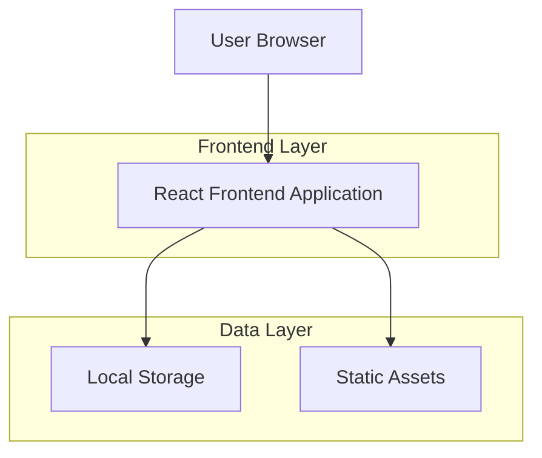
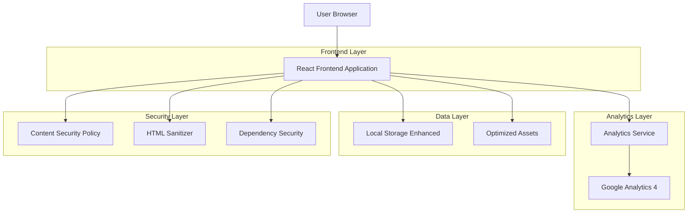
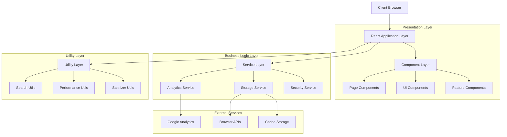
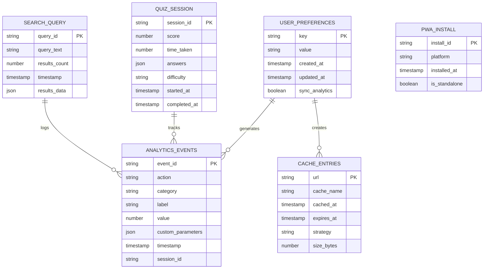

# Technical Architecture Enhancement Document
## Islamic Chronicle Quest - Enhanced Architecture Design

---

## 1. Architecture Design

### Current vs Enhanced Architecture

**Current Architecture:**


**Enhanced Architecture:**


---

## 2. Technology Description

### Enhanced Technology Stack

**Frontend:**
- React@19.2.0 + TypeScript@5.9.3
- Vite@7.1.7 (updated for security)
- Tailwind CSS@4.1.14
- Framer Motion (code-split)


**Analytics & Tracking:**
- Google Analytics 4 (gtag)
- Custom Event Tracking
- User Behavior Analytics
- Performance Monitoring

**Security Enhancements:**
- DOMPurify (HTML sanitization)
- Content Security Policy
- Updated dependencies (zero vulnerabilities)

**Performance Optimization:**
- Dynamic imports (React.lazy)
- Manual chunk splitting
- Image optimization (WebP, JPEG optimization)
- Tree shaking optimization

---

## 3. Route Definitions

### Enhanced Route Structure with Code Splitting

| Route | Purpose | Bundle Chunk | Loading Strategy |
|-------|---------|--------------|------------------|
| / | Home page with hero and navigation | main-chunk | Immediate |
| /timeline | Historical timeline with events | timeline-feature | Lazy loaded |
| /quiz | Interactive quiz functionality | quiz-feature | Lazy loaded |
| /settings | User preferences and configuration | settings-chunk | Lazy loaded |
| /about | About page and information | about-chunk | Lazy loaded |
| /download | Download page | download-chunk | Lazy loaded |
| * | 404 error page | error-chunk | Lazy loaded |

---

## 4. API Definitions

### 4.1 Analytics API

**Event Tracking API:**
```typescript
interface AnalyticsEvent {
  action: string;
  category: string;
  label?: string;
  value?: number;
  custom_parameters?: Record<string, any>;
}

// Track custom events
POST /analytics/event
```

Request:
| Param Name | Param Type | isRequired | Description |
|------------|------------|------------|-------------|
| action | string | true | Event action (click, view, complete) |
| category | string | true | Event category (quiz, navigation, settings) |
| label | string | false | Additional event label |
| value | number | false | Numeric value for the event |

Response:
| Param Name | Param Type | Description |
|------------|------------|-------------|
| success | boolean | Event tracking status |
| event_id | string | Unique event identifier |

Example:
```json
{
  "action": "quiz_complete",
  "category": "engagement",
  "label": "islamic_history_quiz",
  "value": 85,
  "custom_parameters": {
    "score": 85,
    "time_taken": 120,
    "difficulty": "medium"
  }
}
```

### 4.2 User Preferences API

**Enhanced LocalStorage API:**
```typescript
interface UserPreference {
  key: string;
  value: string;
  timestamp: string;
  sync_analytics: boolean;
}

// Set user preference with analytics
POST /preferences/set
```

Request:
| Param Name | Param Type | isRequired | Description |
|------------|------------|------------|-------------|
| key | string | true | Preference key (theme, fontSize, etc.) |
| value | string | true | Preference value |
| sync_analytics | boolean | false | Whether to track this change |

---

## 5. Server Architecture Diagram

### Enhanced Client-Side Architecture



---

## 6. Data Model

### 6.1 Enhanced Data Model Definition



### 6.2 Data Definition Language

**Browser Storage Schema:**

```typescript
// LocalStorage Enhanced Schema
interface UserPreferences {
  theme: 'light' | 'dark';
  fontSize: 'small' | 'medium' | 'large' | 'extra-large';
  language: 'id' | 'en' | 'ar';
  notifications: boolean;
  analytics_consent: boolean;
  last_quiz_score: number;
  favorite_topics: string[];
  created_at: string;
  updated_at: string;
}

// IndexedDB Schema for Offline Data
interface OfflineData {
  id: string;
  type: 'timeline_event' | 'quiz_question' | 'search_result';
  data: any;
  cached_at: string;
  expires_at: string;
}

// Analytics Events Schema
interface AnalyticsEvent {
  event_id: string;
  action: string;
  category: string;
  label?: string;
  value?: number;
  custom_parameters?: Record<string, any>;
  timestamp: string;
  session_id: string;
  user_agent: string;
  page_url: string;
}
```

**Service Worker Cache Schema:**

```typescript
// Cache Storage Structure
interface CacheEntry {
  url: string;
  cache_name: string;
  cached_at: string;
  expires_at: string;
  strategy: 'cache_first' | 'network_first' | 'stale_while_revalidate';
  size_bytes: number;
  content_type: string;
}

// Cache Names
const CACHE_NAMES = {
  STATIC: 'islamic-chronicle-static-v1',
  DYNAMIC: 'islamic-chronicle-dynamic-v1',
  IMAGES: 'islamic-chronicle-images-v1',
  API: 'islamic-chronicle-api-v1'
};
```

**Performance Monitoring Schema:**

```typescript
// Performance Metrics
interface PerformanceMetrics {
  metric_id: string;
  metric_type: 'LCP' | 'FID' | 'CLS' | 'TTFB' | 'FCP';
  value: number;
  timestamp: string;
  page_url: string;
  user_agent: string;
  connection_type: string;
}

// Bundle Analysis Data
interface BundleMetrics {
  chunk_name: string;
  size_bytes: number;
  gzip_size_bytes: number;
  load_time_ms: number;
  is_critical: boolean;
  dependencies: string[];
}
```

---

## 7. Security Architecture

### 7.1 Content Security Policy Implementation

```typescript
// CSP Configuration
const CSP_DIRECTIVES = {
  'default-src': ["'self'"],
  'script-src': [
    "'self'",
    "'unsafe-inline'", // For inline scripts (minimize usage)
    "https://www.googletagmanager.com",
    "https://www.google-analytics.com"
  ],
  'style-src': [
    "'self'",
    "'unsafe-inline'", // For Tailwind CSS
    "https://fonts.googleapis.com"
  ],
  'img-src': [
    "'self'",
    "data:",
    "https:",
    "blob:"
  ],
  'font-src': [
    "'self'",
    "https://fonts.gstatic.com"
  ],
  'connect-src': [
    "'self'",
    "https://www.google-analytics.com",
    "https://analytics.google.com"
  ],
  'frame-src': ["'none'"],
  'object-src': ["'none'"],
  'base-uri': ["'self'"],
  'form-action': ["'self'"]
};
```

### 7.2 HTML Sanitization Strategy

```typescript
// Sanitization Configuration
const SANITIZER_CONFIG = {
  ALLOWED_TAGS: [
    'b', 'i', 'em', 'strong', 'mark', 'span', 'div',
    'p', 'br', 'ul', 'ol', 'li', 'h1', 'h2', 'h3'
  ],
  ALLOWED_ATTR: [
    'class', 'id', 'data-*'
  ],
  FORBID_TAGS: [
    'script', 'object', 'embed', 'iframe', 'form',
    'input', 'button', 'link', 'style'
  ],
  FORBID_ATTR: [
    'onclick', 'onload', 'onerror', 'onmouseover',
    'javascript:', 'vbscript:', 'data:'
  ]
};
```

---

## 8. Performance Optimization Strategy

### 8.1 Bundle Splitting Configuration

```typescript
// Vite Bundle Configuration
const BUNDLE_CONFIG = {
  manualChunks: {
    // Vendor chunks (stable, rarely changing)
    'react-vendor': ['react', 'react-dom'],
    'router-vendor': ['react-router-dom'],
    'ui-vendor': [
      '@radix-ui/react-accordion',
      '@radix-ui/react-alert-dialog',
      '@radix-ui/react-avatar'
    ],
    
    // Feature chunks (by functionality)
    'quiz-feature': [
      './src/pages/Quiz.tsx',
      './src/components/InteractiveQuiz.tsx'
    ],
    'timeline-feature': [
      './src/pages/Timeline.tsx',
      './src/components/HistoricalPhases.tsx'
    ],
    'search-feature': [
      './src/components/SearchSection.tsx',
      './src/components/SearchDropdown.tsx',
      './src/utils/searchUtils.ts'
    ],
    
    // Utility chunks
    'animation-vendor': ['framer-motion'],
    'icon-vendor': ['lucide-react'],
    'form-vendor': ['react-hook-form', '@hookform/resolvers']
  }
};
```

### 8.2 Image Optimization Strategy

```typescript
// Image Optimization Configuration
const IMAGE_CONFIG = {
  formats: ['webp', 'jpeg', 'png'],
  quality: {
    webp: 80,
    jpeg: 85,
    png: 90
  },
  sizes: {
    thumbnail: 150,
    small: 300,
    medium: 600,
    large: 1200,
    hero: 1920
  },
  lazy_loading: true,
  progressive: true
};
```

---

## 9. PWA Implementation Strategy

### 9.1 Service Worker Caching Strategy

```typescript
// Caching Strategies
const CACHE_STRATEGIES = {
  // Static assets - Cache First
  static: {
    strategy: 'CacheFirst',
    cacheName: 'static-cache-v1',
    expiration: {
      maxEntries: 100,
      maxAgeSeconds: 30 * 24 * 60 * 60 // 30 days
    }
  },
  
  // API responses - Network First
  api: {
    strategy: 'NetworkFirst',
    cacheName: 'api-cache-v1',
    expiration: {
      maxEntries: 50,
      maxAgeSeconds: 5 * 60 // 5 minutes
    }
  },
  
  // Images - Stale While Revalidate
  images: {
    strategy: 'StaleWhileRevalidate',
    cacheName: 'image-cache-v1',
    expiration: {
      maxEntries: 200,
      maxAgeSeconds: 7 * 24 * 60 * 60 // 7 days
    }
  }
};
```

### 9.2 Offline Functionality

```typescript
// Offline Pages Configuration
const OFFLINE_CONFIG = {
  fallback_pages: {
    '/': '/offline.html',
    '/timeline': '/offline-timeline.html',
    '/quiz': '/offline-quiz.html'
  },
  offline_data: {
    essential_timeline_events: 50,
    cached_quiz_questions: 20,
    user_preferences: 'always'
  }
};
```

---

## 10. Analytics Implementation Strategy

### 10.1 Event Tracking Schema

```typescript
// Analytics Events Configuration
const ANALYTICS_CONFIG = {
  // Page tracking
  page_views: {
    track_automatically: true,
    include_user_properties: true,
    custom_dimensions: ['theme', 'language', 'device_type']
  },
  
  // User interactions
  interactions: {
    quiz_events: ['start', 'answer', 'complete', 'retry'],
    search_events: ['query', 'result_click', 'no_results'],
    navigation_events: ['menu_click', 'back_button', 'external_link'],
    settings_events: ['theme_change', 'font_change', 'language_change']
  },
  
  // Performance tracking
  performance: {
    core_web_vitals: true,
    custom_metrics: ['bundle_load_time', 'search_response_time'],
    error_tracking: true
  }
};
```

---

## 11. Implementation Roadmap

### Phase 1: Foundation (Week 1)
- Security vulnerability fixes
- Dependency updates
- Basic PWA setup

### Phase 2: Core Features (Week 2)
- Service Worker implementation
- Analytics integration
- HTML sanitization

### Phase 3: Optimization (Week 3)
- Bundle splitting
- Image optimization
- Performance monitoring

### Phase 4: Testing & Deployment (Week 4)
- Comprehensive testing
- Performance validation
- Production deployment

---

## 12. Success Metrics

### Performance Targets:
- **Lighthouse PWA Score:** 90+
- **Bundle Size Reduction:** 30-40%
- **Load Time Improvement:** 25-35%
- **Cache Hit Rate:** 80%+

### Security Targets:
- **Zero npm vulnerabilities**
- **CSP compliance:** 100%
- **XSS protection:** Complete

### User Experience Targets:
- **Offline functionality:** Available
- **Install prompt:** Functional
- **Analytics coverage:** 95%+
- **Error rate:** <1%

---

*This enhanced technical architecture provides a comprehensive foundation for implementing all critical improvements while maintaining system stability and user experience.*